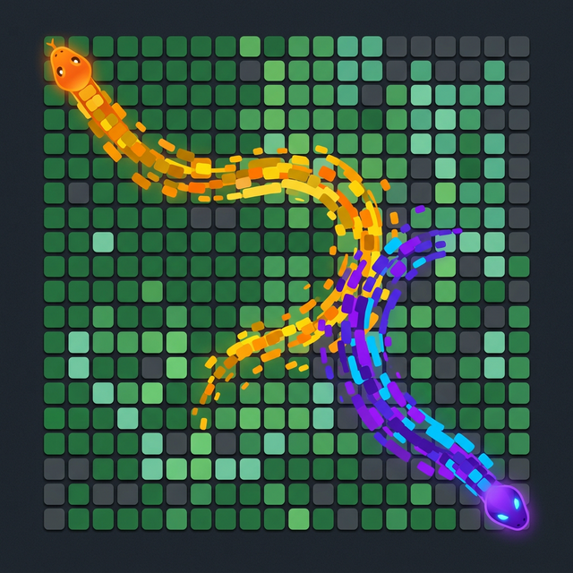

<div align="center">

# 🦑 contribution-splatoon

**Two snakes. One grid. A territory battle on your GitHub contribution graph.**



*Inspired by [Splatoon](https://en.wikipedia.org/wiki/Splatoon) — two snakes race across your contribution grid, painting territory in their colors. Who covers more ground?*

[](LICENSE)

</div>

---

## 🎯 What is this?

A GitHub Action that generates an animated SVG of two snakes battling for territory on your GitHub contribution graph — like a Splatoon ink battle.

Unlike the classic [Platane/snk](https://github.com/Platane/snk) (single snake eating cells), this project features:

- 🐍🐍 **Two snakes** starting from opposite corners
- 🎨 **Territory painting** — each snake leaves a colored trail
- ⚔️ **Competitive AI** — snakes compete to cover more ground
- 📊 **Score display** — shows final territory percentage
- 🌙 **Dark mode support** — separate themes for light/dark

## ⚡ Quick Start

```yaml
# .github/workflows/splatoon.yml
name: Generate Splatoon Animation

on:
  schedule:
    - cron: "0 0 * * *"
  workflow_dispatch:

permissions:
  contents: write

jobs:
  generate:
    runs-on: ubuntu-latest
    steps:
      - uses: crosscore/contribution-splatoon@v1
        with:
          github_user_name: ${{ github.repository_owner }}
          outputs: |
            dist/splatoon.svg
            dist/splatoon-dark.svg?palette=dark

      - uses: crazy-max/ghaction-github-pages@v4
        with:
          target_branch: output
          build_dir: dist
        env:
          GITHUB_TOKEN: ${{ secrets.GITHUB_TOKEN }}
```

Then add to your profile README:

```html
<picture>
  <source media="(prefers-color-scheme: dark)" srcset="https://raw.githubusercontent.com/<user>/<user>/output/splatoon-dark.svg" />
  <source media="(prefers-color-scheme: light)" srcset="https://raw.githubusercontent.com/<user>/<user>/output/splatoon.svg" />
  /<user>/output/splatoon-dark.svg" />
</picture>
```

## 🎨 Customization

| Option | Default | Description |
|--------|---------|-------------|
| `color_snake_1` | `#FF6B00` | Color of Snake 1 (orange) |
| `color_snake_2` | `#7B3FF2` | Color of Snake 2 (purple) |
| `color_trail_1` | `#FFB366` | Trail color of Snake 1 |
| `color_trail_2` | `#B088F9` | Trail color of Snake 2 |
| `speed` | `1` | Animation speed multiplier |
| `strategy` | `aggressive` | AI strategy: `aggressive`, `balanced`, `random` |

## 🏗️ Architecture

```
src/
├── fetcher/          # GitHub contribution graph API
├── solver/           # Snake AI pathfinding (A*, greedy)
├── renderer/         # SVG animation generator
│   ├── grid.ts       # Contribution grid rendering
│   ├── snake.ts      # Snake body + trail rendering
│   └── animation.ts  # Keyframe animation engine
├── game/             # Game loop & territory logic
│   ├── engine.ts     # Turn-based game simulation
│   ├── snake.ts      # Snake state & movement
│   └── territory.ts  # Score calculation
└── action/           # GitHub Action entry point
```

## 🛠️ Development

```bash
npm install
npm run dev        # Local dev server with live preview
npm run build      # Build the GitHub Action
npm run test       # Run tests
```

## 📄 License

MIT
